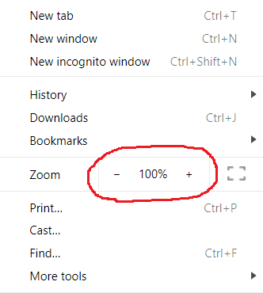
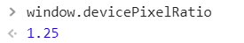
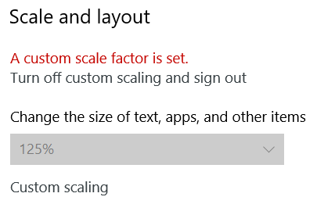

# enhanceZoom.js

**enhanceZoom.js** is an extremely small plugin (45 lines uncompressed) that changes zoom behavior of your elements (or whole page). You can use **enhanceZoom.js** to do a lot of things:
 - Prevent zoom on a page (Force 100% zoom)
 - Prevent zoom on some elements on a page  
 - Set different zoom factors on different elements 
 - Custom mathematical expressions for zoom behavior
 - Solve 'custom screen DPI' related problems
 - Invert zoom behavior!

## How it works
When searching for a method to disable zoom on a page, I have often found solutions that override `Ctrl` + `mousewheel`, `Ctrl` + `+` or `Ctrl` + `-` events. This plugin uses a completely different method. `window.devicePixelRatio` is a window property  that  returns the ratio of the resolution in  _physical pixels_  to the resolution in  _CSS pixels_  for your device. It is supported by all modern browsers. (See [here](https://developer.mozilla.org/en-US/docs/Web/API/Window/devicePixelRatio)) By using this property, **enhanceZoom.js** dynamically adds CSS rules to `head` of your document. Then, by default, it adds a `resize` listener in order to listen zoom events. When a zoom-in or zoom-out is happened, it updates the CSS rules with the newly computed scaling factor.


## Examples
### Prevent zoom on a page  ([See Example](https://codepen.io/onurkerimov/pen/BVYvBy))

```js
$.enhanceZoom('body', { factor: 0, stretch: true })
```
### Prevent zoom on some elements
```js
$.enhanceZoom('div#sidebar, span#ads', { factor: 0 })
```
### Set different zoom factors on different elements  ([See Example](https://codepen.io/onurkerimov/pen/wXyOZv))
```js
$.enhanceZoom('div#sidebar, span#ads', { factor: 0.8, stretch: true }) // zooms less than usual
$.enhanceZoom('div#main', { factor: 1 }) // zooms as usual
$.enhanceZoom('ul > li > a', { factor: 1.2 }) // zooms more than usual
$.enhanceZoom('ul > li > a', { factor: -0.5 }) // zooms inverted!
```
### Custom mathematical expressions
```js
$.enhanceZoom('div#sidebar, span#ads', { formula: (r) => Math.abs(r-1)+1 }) 
// This example sets 100% zoom as the minimum possible zoom
// r stands for window.devicePixelRatio
```
### Solve ‘custom screen DPI’ related problems (More on this [below](#custom-screen-dpi-related-problems))
```js
$.enhanceZoom('div') // When no option is provided, the plugin assumes: factor = 0.99
```

### Invert zoom!  ([See Example](https://codepen.io/onurkerimov/pen/zaRQBQ))
```js
$.enhanceZoom('body', { factor: -1, stretch: true }) //setting negative factor inverts
```
## Custom screen DPI related problems
I observed that while in my Chrome settings, zoom value was set to 100%, the value of `window.devicePixelRatio` was strangely 1.25.

| Chrome Settings | Devtools Console |
|--|--|
|  |  |
  
It turns out that zoom setting of browser secretly obeys the OS's DPI settings.



## License

Licensed under the MIT license.
